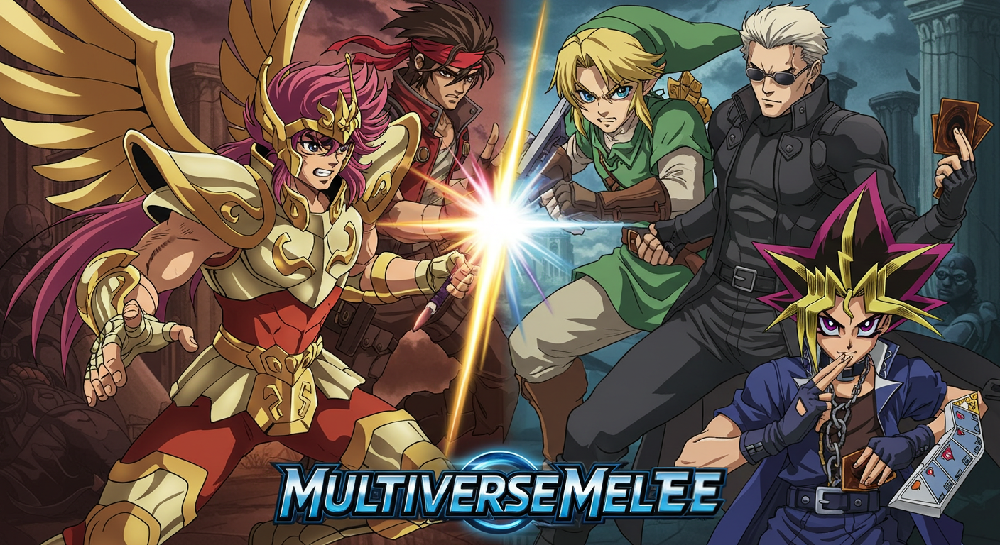
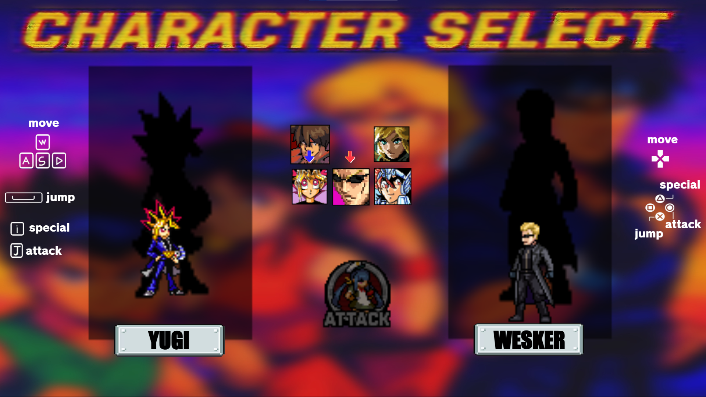
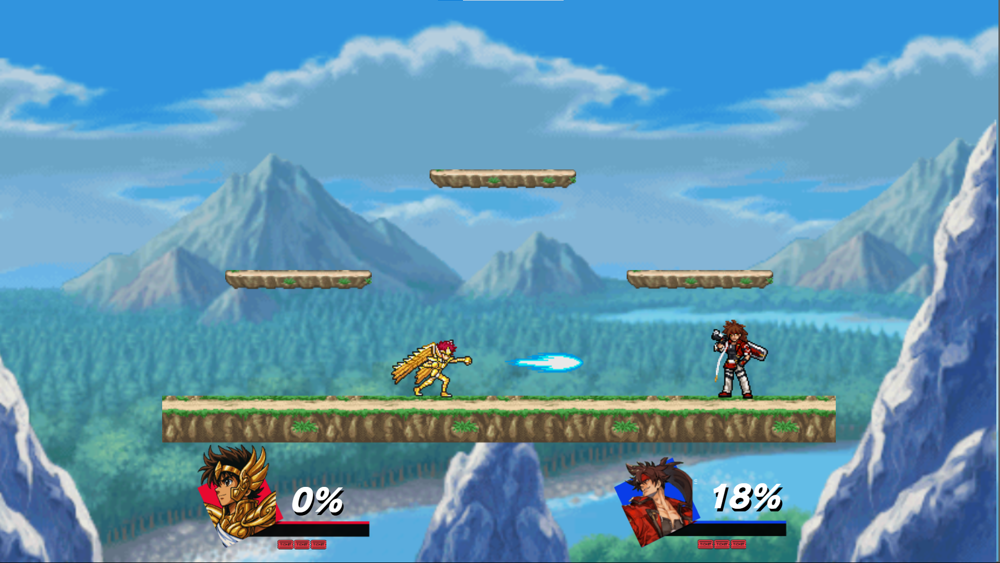
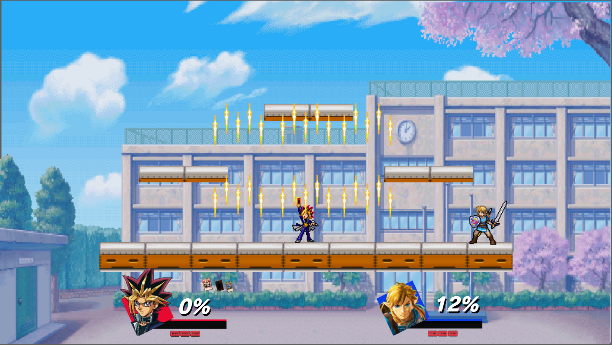
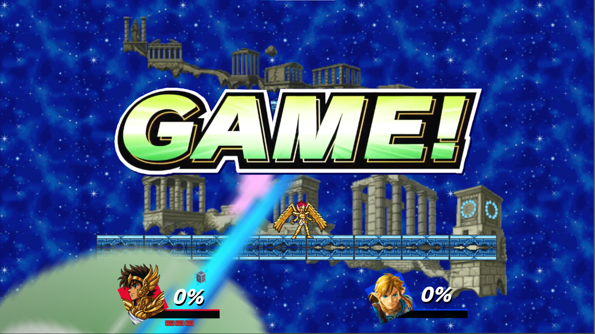

# Super Multiversus Melee
### PLAY ###
https://rankioshi.itch.io/super-multiverse-melee

A **Smash Bros-style fighting game** built in **Construct**, featuring iconic characters from anime and games. The goal is simple: knock your opponent out until their lives hit zero.

## Playable Characters

- Sol Badguy  
- Link  
- Yugi  
- Wesker  
- Seiya

## Available Stages

The game features **4 unique stages**, each with distinct visuals and challenges.

## How to Play

### 2-Player Mode:
- **Player 1**:
  - Movement: `W`, `A`, `S`, `D`
  - Light Attack: `J`
  - Strong Attack: `I`
- **Player 2** (Controller):
  - Movement: D-Pad and A to jump
  - Attacks: B and Y

### Solo Mode:
- Use the **Arrow Keys** to control Player 1
- Press **Spacebar** to auto-select a character for Player 2

## Objective

Each player starts with a set number of lives.  
**The player who runs out of lives first loses**. Knock your opponent off the stage as many times as possible!

